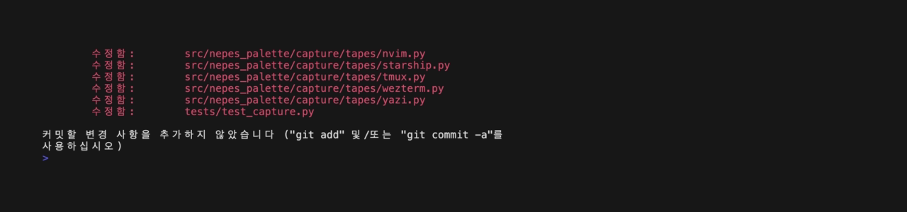

#+title: starship-nepes
#+description: Nepes color theme for starship

Cross-shell prompt palette.

Part of the [[https://github.com/kayspark][Nepes Colorscheme]] suite.

* Screenshots

| Dark | Light |
|------+-------|
|  | [[file:docs/light.png]] |

* Installation

1. Clone this repo
2. Add palette to =~/.config/starship.toml=

* Related

- [[https://github.com/kayspark/nepes-palette][nepes-palette]] — single source of truth for all Nepes themes
- [[https://github.com/kayspark/fish-nepes][fish-nepes]] — fish shell colors displayed alongside this prompt
- [[https://github.com/kayspark/tmux-nepes][tmux-nepes]] — multiplexer status bar that hosts this prompt

* Credits

Generated by [[https://github.com/kayspark/nepes-palette][nepes-palette]].
